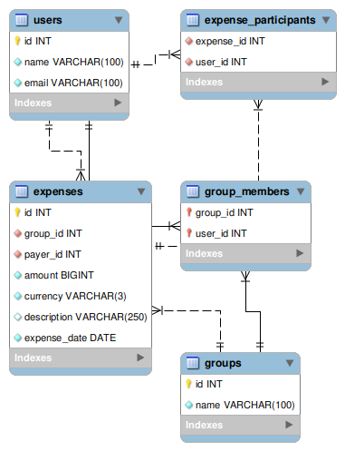

# [ Project Name: Smart Expense Splitter]
> A robust Java application for managing group expenses, tracking debts, and calculating settlements using raw JDBC and MySQL.


## 📖 Overview
This application solves the common problem of splitting bills among friends. It allows users to create groups, add expenses in multiple currencies, and automatically tracks who paid what.

Unlike standard ORM-based solutions, this project demonstrates a **deep understanding of SQL optimization**, utilizing complex joins and custom data mapping to ensure high performance.

## ✨ Key Features
* **Group Management:** Create groups and manage members.
* **Expense Tracker:** Support for expenses with single payers and multiple participants.
* **Debt Calculation:** Automatically calculates how much each participant owes.
* **Smart Data Retrieval:** Optimized algorithms to fetch complex hierarchical data.

## ⚙️ Technical Highlights (The "Why")
This project was built to demonstrate proficiency in **Backend Engineering** and **Database Optimization**.

### 🏗️ Solving the "N+1 Selects" problem
A common pitfall in retrieving hierarchical data (Groups -> Expenses -> Participants) is the "N+1 Problem," where the application executes one query for the parent and separate queries for every child record.

**My Solution:**
I implemented a **Single-Query Architecture** in the Data Access Object (DAO).
* **SQL:** utilized `LEFT JOIN`s to fetch Expenses, Payers, and Participants in one go.
* **Java:** Designed a custom mapping algorithm using `HashMap` and object references to reconstruct the `Expense` and `Participant` objects from the flat `ResultSet` without data duplication.

## 🗄️ Database Schema
The application uses a normalized relational database:
* **Users:** Stores generic user info.
* **Groups:** Stores group metadata.
* **Expenses:** Linked to group and a specific payer.
* **Expense_Participants:** A junction table linking Expenses to Users (Participants).
* **Group_Members:** A junction table linking Groups to Users (Members).



## 🚀 Getting Started:

### Prerequisites:
* Java Development Kit (JDK) 11 or higher.
* MySQL Server (Local or Docker container).
* IDE (IntelliJ, Eclipse, etc.).

### Installation:
1. **Clone the repository**
   ```bash
   git clone [https://github.com/Lior-Karayev/SmartExpenseSplitter.git](https://github.com/Lior-Karayev/SmartExpenseSplitter.git)
   ```
2. **Setup the Database**
   * Run the `schema.sql` script located in `/sql` folder to create the tables.
   * Create `config.properties` file in the root folder, copy the content from `config.properties.example`, and fill your DB credentials.
3. **Run the Application:**
   * Run the `Main.java` file to start console interface.

## 📝 Usage Example
```text
Welcome to Smart Expense Splitter.
----------------------------------
1. Create User
2. Create Group
3. Add member to group
4. List users
5. List groups
6. Add expense to group
7. Show group balance
9. Exit
Enter your choice: 3

> Enter group name: Vacation 2024
> Group created: Vacation 2024
> ...
```

## 🛠️ Built With
* **Java** - Core application logic.
* **JDBC** - Low-level database connectivity.
* **MySQL** - Relational database management.

## 👤 Author
**Lior Karayev**
* LinkedIn: [https://www.linkedin.com/in/lior-karaev-00ba772ab/](https://www.linkedin.com/in/lior-karaev-00ba772ab/)
* GitHub: [https://github.com/Lior-Karayev](https://github.com/Lior-Karayev)